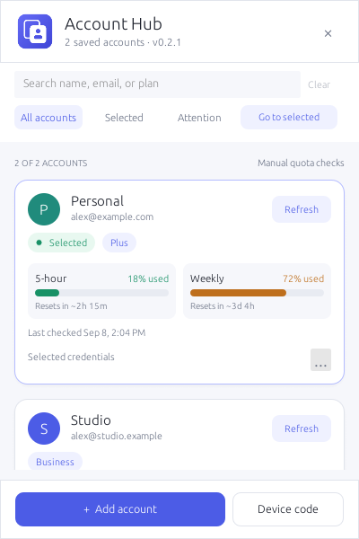

# Codex Account Hub

[](https://github.com/weequan93/codex-auth-ui/actions/workflows/ci.yml)

A small native menu-bar app for organizing saved Codex accounts, selecting
file-based credentials, and viewing manually refreshed usage windows.

**Independent and experimental. Not affiliated with or endorsed by OpenAI.**
Account Hub is not a rate-limit bypass and does not automatically switch live
desktop or CLI sessions.



## Install

**macOS:** download the appropriate DMG from the [Releases page](https://github.com/weequan93/codex-auth-ui/releases),
read the release notes, then drag the app into Applications. Choose **arm64**
for Apple Silicon or **x86_64** for Intel.

Default builds are locally signed but **not Developer ID signed or notarized**.
They may be blocked by macOS. Read the [installation guide](docs/install.md)
before opening a downloaded build. Windows has compile/test infrastructure but
no validated installer or supported runtime release yet.

If no release is published yet, use the local build instructions below. Drafts
are maintainer-only and are not public downloads.

Prefer building locally? Install Rust through rustup and Xcode command-line
tools, then run from the project directory:

```sh
bash scripts/package-macos.sh
```

The script uses the pinned Rust toolchain, requires Python 3.9+, and reveals a
fresh app in Finder. It does not replace your installed app automatically.
Add `--dmg` to create a disk image and checksum.

## What it does

- Search by account name, email, or plan; filter Selected or Attention accounts.
- Keep accounts in saved order, so switching does not move cards around.
- Use **Go to selected** to clear filters and scroll to the selected account without switching.
- Display cached 5-hour and weekly usage with reset countdowns.
- Add accounts with browser or device-code sign-in through the installed Codex CLI.
- Rename accounts and require confirmation before removing saved snapshots.
- Guard credential changes when Codex processes are detected.
- Offer a separately confirmed, cooperative desktop restart on macOS.
- Run natively in Rust with egui/eframe—no browser runtime.

## Everyday use

Click the tray icon to show or hide the panel. Right-click for the native menu.
Use **Cmd+F** (Ctrl+F on Windows development builds) to search. Escape cancels
dialogs first, then clears search/filter state before hiding the panel.
The version appears in the header.

**Selected** means credentials saved in the shared auth file, not proof that a
running client has adopted them. Finish work and close existing sessions before
switching. The selected account's **… → Session & restart** menu explains the
restart options. CLI sessions are reopened manually; tasks are not resumed by Hub.

**Refresh is manual.** It calls an undocumented backend endpoint, outside the
published API, and requires a first-use risk acknowledgement. That endpoint may
change or stop working. Do not use quota refresh if this is unacceptable.
A cached countdown is an estimate, not a guarantee that quota is available.
Missing data is unknown, not zero. No background quota polling is performed.

## Data and privacy

Hub uses `CODEX_HOME` when set, otherwise `~/.codex`:

| Data | Path relative to CODEX_HOME |
| --- | --- |
| Live credentials | `auth.json` |
| Shared registry | `accounts/registry.json` |
| Saved account snapshots | `accounts/<encoded-key>.auth.json` |
| Rolling backups | `auth.json.bak`, `accounts/registry.json.bak` |

App preferences use a separate platform-standard configuration directory.
Sensitive files use owner-only permissions on Unix; snapshots are **not encrypted**.
No analytics or automatic update checks are implemented. Login contacts the services
used by the installed CLI; manual Refresh sends authentication to the quota endpoint.

Hub supports file-based credentials, not keychain-managed or separately configured
sign-ins. Clients must use the same CODEX_HOME. Registry backups and optimistic
write checks are not a cross-client transaction lock: run one Hub instance and
avoid concurrent credential changes.

Never upload auth files, registries, tokens, device codes, or private logs.
To uninstall, quit Hub and move only its app to Trash. **Do not delete the shared
Codex directory.** See [installation and troubleshooting](docs/install.md).

## Development

Rust 1.88 is pinned in `rust-toolchain.toml`. Commit Cargo.lock for reproducible
dependency resolution.

```sh
cargo run --locked
cargo fmt --all -- --check
cargo test --locked
cargo clippy --locked --all-targets --all-features -- -D warnings
python3 scripts/release.py check
python3 -m unittest discover -s scripts -p 'test_*.py'
```

For a safe UI preview, without credentials, a worker thread, or network requests:

```sh
CODEX_ACCOUNT_HUB_PREVIEW=accounts cargo run --features visual-qa
```

Scenarios include `accounts`, `empty`, `long`, `login`, `error`, `rename`,
`remove`, `disclosure`, `guard`, `stale`, `missing`, `api`, `selected`,
`restart`, `restarted`, and `restart-failed`. Add
`EFRAME_SCREENSHOT_TO=/tmp/account-hub-preview.png` to save a frame and exit.
Do not enable `visual-qa` in a distributed build.

Automated tests use synthetic data and owned fake processes. They do not validate
real sign-in, real quota requests, or every supported OS. See the
[architecture](docs/architecture.md) and [contribution guide](CONTRIBUTING.md).

## Releases and support

- [Changelog](CHANGELOG.md)
- [Versioning, packaging, and draft release workflow](docs/releasing.md)
- [Sensitive issue reporting](SECURITY.md)

The release workflow builds macOS artifacts and creates a **draft prerelease**.
A maintainer must review signing status, licensing, and clean-machine tests before
publishing. No public release or support guarantee is implied by a passing local build.

## License

Project code is [MIT licensed](LICENSE). Dependencies retain their own licenses;
review the generated dependency inventory and required notices before distribution.
