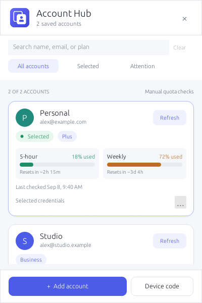

# Dashboard redesign

## Version 0.2.1 — predictable account positions

- All accounts now follows saved order, replacing the selected-first presentation.
  Switching accounts does not change their positions or neighbors.
- Go to selected clears search and filters, opens All accounts, and scrolls to the
  selected card. It never switches credentials or changes saved order.
- The navigation button is disabled when no saved account is selected.
- Scroll requests are one-shot, so later manual scrolling is not overridden.
- Automated UI tests cover a selected account in the middle of a nine-account list,
  clearing restrictive filters, and navigation without a valid selection.

## Version 0.2.0 — account navigation

- Persistent search by display name, email, or plan; Cmd+F/Ctrl+F focuses it.
- All accounts, Selected, and Attention filters. Attention means an account has a
  recorded quota/sign-in error; it does not imply automatic background checks.
- The selected account appears first, without changing the saved registry order.
- Smaller avatars, lighter shadows, fewer redundant badges, and side-by-side
  5-hour/weekly quota tiles reduce card height while retaining reset countdowns.
- Search has a clear action and an explicit no-results recovery. Escape cancels
  dialogs first, then clears search/filter state before hiding the panel.
- Actions remain explicit: quota checks are manual, Rename/Remove stay in the
  dropdown, removals require confirmation, and switching retains the process guard.
- The panel remains 400×600 and the previously fixed native tray path is unchanged.

48 automated tests pass, including local-only search/filter behavior, keyboard
search, stable selected-first ordering, long-content layout, and existing safeguards.
Version 0.2.0 (build 4) was installed with user approval on 8 September 2026.
Its signature/startup diagnostics passed and the installed account panel was
visually verified. The previous app is preserved in `dist/installed-backup.zNnvFv/`.

The normal, expired-quota, and long-name native previews were visually checked.
The local app bundle passed signature and startup metadata checks; no real sign-in,
quota refresh, or account switch was used to validate this UI revision.

## Earlier redesign

The screenshot review identified clipped login output, tiny controls, oversized gaps,
duplicate email labels, and weak separation between account identity, quota, and actions.

The redesigned native panel is 400×600. Its header and footer have explicit initial
heights so they paint correctly from the first frame. Account content scrolls between
them, including long sign-in/error messages and expanded rename/removal states.

- Account avatars, compact plan/status badges, and a visible Refresh action establish
  the card hierarchy. Full names and emails remain available on hover when truncated.
- Quota meters use green, amber, or red at increasing usage levels. Percentage labels,
  reset countdowns, and last-checked timestamps remain visible independently of color.
- Reset windows show a refresh prompt without an outdated percentage or progress bar.
- Rename and Remove live in each card's ellipsis dropdown; double-clicking the name
  still opens rename. Escape cancels rename or
  removal before hiding the panel. Removal still requires a second click.
- Login output has terminal control sequences removed and wraps within a bounded,
  scrollable transcript so device codes survive subsequent instructions. Copy and
  Cancel actions remain visible, and account actions are disabled during sign-in.
- Quota checks remain manual, the first-use disclosure still blocks requests, and
  account switching still uses the process guard.

Synthetic previews exercise normal, empty, long-text, login/error, rename/removal,
disclosure, process-guard, stale-quota, and API-key states. These previews have no
worker thread and cannot perform account operations or write preferences.

Live authentication and real-account switching are separate from this visual check.

## App identity

The icon uses overlapping account cards and a cut-out profile on a rounded indigo
tile. The header and window share the same artwork. macOS uses an enlarged monochrome
template silhouette that adapts to menu-bar appearance; other platforms use the
colored tile. Coverage supersampling smooths edges at small sizes, and the header
texture is cached rather than regenerated each frame.

The account-free artwork preview is available with
`cargo run --example icon_preview --features visual-qa`.
